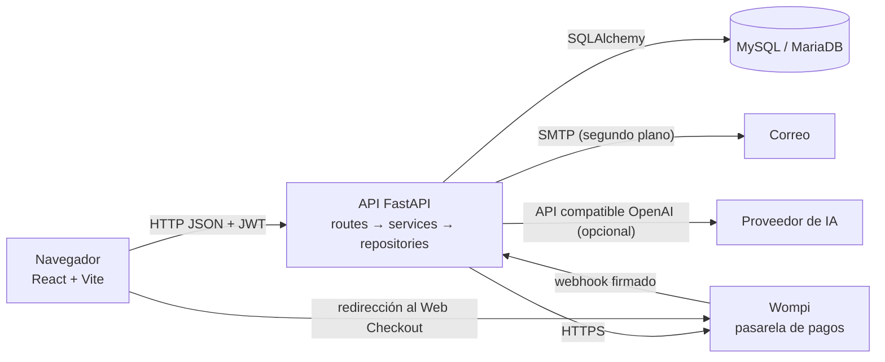
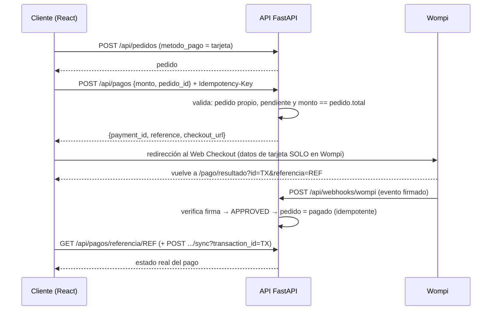

# Manual técnico — Dulce Esencia Pastelería

**Versión:** 5.0 (quinto avance) · **Stack:** FastAPI + SQLAlchemy 2.0 + MySQL/MariaDB · React 19 + Vite · Wompi (pagos) · IA opcional

## 1. Descripción general
Tienda en línea de pastelería con catálogo, carrito, pedidos, **pago con tarjeta (Wompi)**, punto de venta, facturas PDF, reportes, PQR y un asistente virtual. Roles: `cliente`, `empleado`, `admin`.

## 2. Arquitectura

Capas del backend: **routes** (HTTP) → **services** (reglas de negocio) → **repositories/models** (datos). Los **schemas** Pydantic validan entradas y salidas. Detalle de carpetas: [CONCEPTOS-Y-PRINCIPIOS.md §8](CONCEPTOS-Y-PRINCIPIOS.md#8-utilidad-de-cada-carpetacomponente-del-proyecto).

## 3. Requisitos
- Python 3.12 · Node.js 22 · XAMPP (MariaDB/MySQL) o cualquier MySQL 8.
- Cuenta de comercio en **Wompi Sandbox** (para probar pagos) — opcional para el resto.

## 4. Instalación y ejecución local
**Base de datos**
1. Inicia MySQL en XAMPP y crea la base (`essentia` u otro nombre) desde phpMyAdmin.
2. Importa `backend/database/schema_fastapi.sql`. Al arrancar, la API también sincroniza columnas faltantes.

**Backend**
```bash
cd backend
python -m venv .venv
.venv\Scripts\activate          # Windows   (Linux/Mac: source .venv/bin/activate)
pip install -r requirements.txt
copy .env.example .env          # Linux/Mac: cp .env.example .env   → edita los valores
uvicorn app.main:app --reload   # http://localhost:8000  ·  docs: /docs  ·  /redoc
```
Genera una `SECRET_KEY` fuerte: `python -c "import secrets; print(secrets.token_hex(32))"`.
El primer administrador: registra un usuario, verifica el correo y ejecuta en SQL `UPDATE usuarios SET rol='admin' WHERE correo='tu@correo';`.

**Frontend**
```bash
cd frontend
copy .env.example .env          # VITE_API_URL=http://localhost:8000/api
npm ci
npm run dev                     # http://localhost:5173
```

### Variables de entorno (backend, ver `backend/.env.example`)
| Grupo | Variables |
|---|---|
| Base de datos | `DB_HOST`, `DB_PORT`, `DB_NAME`, `DB_USER`, `DB_PASSWORD` |
| Seguridad | `SECRET_KEY`, `ALGORITHM`, `ACCESS_TOKEN_EXPIRE_MINUTES` |
| Entorno / CORS | `NODE_ENV` (`production` oculta los tokens de desarrollo), `FRONTEND_URL`, `CORS_ORIGIN`, `APP_URL` |
| Pagos (Wompi) | `PAYMENT_ENV`, `WOMPI_PUBLIC_KEY`, `WOMPI_PRIVATE_KEY`, `WOMPI_EVENTS_SECRET`, `WOMPI_INTEGRITY_SECRET`, `WOMPI_API_URL`, `WOMPI_CHECKOUT_URL` |
| IA (opcional) | `OPENAI_API_KEY`, `OPENAI_BASE_URL`, `OPENAI_MODEL` |
| Correo (opcional) | `SMTP_HOST`, `SMTP_PORT`, `SMTP_USER`, `SMTP_PASSWORD`, `SMTP_FROM` |

**Nunca** subas `.env` a Git (`.gitignore` ya lo excluye). Frontend: solo `VITE_API_URL` (las variables `VITE_*` quedan visibles en el navegador: jamás pongas secretos ahí).

## 5. Seguridad (resumen)
JWT (HS256) + bcrypt; roles por endpoint (`requiere_rol`); revocación con `token_version`; límite de intentos (429); CORS restringido; validación Pydantic; **consultas preparadas** contra inyección SQL ([SEGURIDAD-SQL-INJECTION.md](SEGURIDAD-SQL-INJECTION.md)); firma HMAC del webhook de Wompi; el monto de un pago se valida en el servidor contra el total del pedido.

## 6. Endpoints
Generados desde `app.openapi()`; la versión interactiva y con ejemplos está en `/docs` (Swagger) y `/redoc`.

| Etiqueta | Método | Ruta | Resumen | Acceso |
|---|---|---|---|---|
| auth | POST | `/api/auth/login` | Iniciar Sesion | público |
| carrito | DELETE | `/api/carrito` | Vaciar Carrito | 🔒 |
| carrito | GET | `/api/carrito` | Ver Carrito | 🔒 |
| carrito | POST | `/api/carrito/fusionar` | Fusionar Carrito | 🔒 |
| carrito | POST | `/api/carrito/items` | Agregar Item | 🔒 |
| carrito | DELETE | `/api/carrito/items/{producto_id}` | Quitar Item | 🔒 |
| carrito | PUT | `/api/carrito/items/{producto_id}` | Actualizar Cantidad Item | 🔒 |
| chatbot | GET | `/api/chatbot/conversaciones/{conversacion_id}` | Obtener Conversacion | 🔒 |
| chatbot | POST | `/api/chatbot/mensaje` | Enviar Mensaje | 🔒 |
| contacto | GET | `/api/contacto` | Listar Mensajes | 🔒 |
| contacto | POST | `/api/contacto` | Enviar Mensaje | público |
| contacto | DELETE | `/api/contacto/{mensaje_id}` | Eliminar Mensaje | 🔒 |
| contacto | GET | `/api/contacto/{mensaje_id}` | Obtener Mensaje | 🔒 |
| cupones | GET | `/api/cupones` | Listar Cupones | 🔒 |
| cupones | POST | `/api/cupones` | Crear Cupon | 🔒 |
| cupones | POST | `/api/cupones/validar` | Validar Cupon | 🔒 |
| cupones | DELETE | `/api/cupones/{cupon_id}` | Eliminar Cupon | 🔒 |
| cupones | GET | `/api/cupones/{cupon_id}` | Obtener Cupon | 🔒 |
| cupones | PUT | `/api/cupones/{cupon_id}` | Actualizar Cupon | 🔒 |
| cupones | PATCH | `/api/cupones/{cupon_id}/estado` | Cambiar Estado Cupon | 🔒 |
| estadisticas | GET | `/api/estadisticas/admin` | Estadisticas Admin | 🔒 |
| estadisticas | GET | `/api/estadisticas/ventas` | Estadisticas Ventas | 🔒 |
| facturas | GET | `/api/facturas` | Listar Facturas | 🔒 |
| facturas | POST | `/api/facturas` | Generar Factura | 🔒 |
| facturas | GET | `/api/facturas/{factura_id}` | Obtener Factura | 🔒 |
| facturas | GET | `/api/facturas/{factura_id}/pdf` | Descargar Factura Pdf | 🔒 |
| pagos | POST | `/api/pagos` | Crear Pago | 🔒 |
| pagos | GET | `/api/pagos/referencia/{referencia}` | Obtener Pago Por Referencia | 🔒 |
| pagos | GET | `/api/pagos/{pago_id}` | Obtener Pago | 🔒 |
| pagos | POST | `/api/pagos/{pago_id}/sync` | Sincronizar Pago | 🔒 |
| pedidos | GET | `/api/pedidos` | Listar Pedidos | 🔒 |
| pedidos | POST | `/api/pedidos` | Crear Pedido | 🔒 |
| pedidos | GET | `/api/pedidos/{pedido_id}` | Obtener Pedido | 🔒 |
| pedidos | POST | `/api/pedidos/{pedido_id}/cancelar` | Cancelar Pedido | 🔒 |
| pedidos | PATCH | `/api/pedidos/{pedido_id}/estado` | Cambiar Estado Pedido | 🔒 |
| pedidos | GET | `/api/pedidos/{pedido_id}/factura` | Descargar Factura Pedido | 🔒 |
| pqr | GET | `/api/pqr` | Listar Pqr | 🔒 |
| pqr | POST | `/api/pqr` | Crear Pqr | 🔒 |
| pqr | GET | `/api/pqr/{pqr_id}` | Obtener Pqr | 🔒 |
| pqr | PATCH | `/api/pqr/{pqr_id}` | Gestionar Pqr | 🔒 |
| productos | GET | `/api/productos` | Listar el catálogo público (paginado y filtrable) | público |
| productos | POST | `/api/productos` | Crear un producto | 🔒 |
| productos | GET | `/api/productos/admin/todos` | Listar Productos Admin | 🔒 |
| productos | POST | `/api/productos/imagen` | Subir Imagen Producto | 🔒 |
| productos | DELETE | `/api/productos/{producto_id}` | Eliminar un producto (solo admin) | 🔒 |
| productos | GET | `/api/productos/{producto_id}` | Consultar un producto por id | público |
| productos | PUT | `/api/productos/{producto_id}` | Actualizar un producto (reemplazo completo) | 🔒 |
| productos | PATCH | `/api/productos/{producto_id}/estado` | Cambiar Estado Producto | 🔒 |
| proveedores | GET | `/api/proveedores` | Listar proveedores (paginado y filtrable) | 🔒 |
| proveedores | POST | `/api/proveedores` | Registrar un proveedor | 🔒 |
| proveedores | DELETE | `/api/proveedores/{proveedor_id}` | Eliminar un proveedor sin productos asociados | 🔒 |
| proveedores | GET | `/api/proveedores/{proveedor_id}` | Consultar un proveedor | 🔒 |
| proveedores | PATCH | `/api/proveedores/{proveedor_id}` | Actualizar parcialmente un proveedor | 🔒 |
| proveedores | PUT | `/api/proveedores/{proveedor_id}` | Reemplazar por completo un proveedor | 🔒 |
| proveedores | POST | `/api/proveedores/{proveedor_id}/reactivaciones` | Reactivar un proveedor suspendido | 🔒 |
| proveedores | POST | `/api/proveedores/{proveedor_id}/suspensiones` | Suspender un proveedor y retirar su catálogo | 🔒 |
| reportes | GET | `/api/reportes/ventas/diario` | Reporte Diario Ventas | 🔒 |
| reportes | GET | `/api/reportes/ventas/diario/excel` | Reporte Diario Ventas Excel | 🔒 |
| reportes | GET | `/api/reportes/ventas/diario/pdf` | Reporte Diario Ventas Pdf | 🔒 |
| reseñas | GET | `/api/productos/{producto_id}/resenas` | Listar Resenas | público |
| reseñas | POST | `/api/productos/{producto_id}/resenas` | Crear Resena | 🔒 |
| reseñas | DELETE | `/api/productos/{producto_id}/resenas/{resena_id}` | Eliminar Resena | 🔒 |
| reseñas | PUT | `/api/productos/{producto_id}/resenas/{resena_id}` | Editar Resena | 🔒 |
| roles | GET | `/api/roles` | Listar Roles | 🔒 |
| roles | GET | `/api/roles/{rol_id}` | Obtener Rol | 🔒 |
| salud | GET | `/` | Mensaje de bienvenida | público |
| salud | GET | `/api/salud/db` | Estado de la conexión a la base de datos | público |
| salud | GET | `/health` | Health | público |
| salud | GET | `/health/db` | Health Db | público |
| servicios | GET | `/api/servicios` | Listar Servicios | público |
| servicios | POST | `/api/servicios` | Crear Servicio | 🔒 |
| servicios | GET | `/api/servicios/admin/todos` | Listar Servicios Admin | 🔒 |
| servicios | POST | `/api/servicios/imagen` | Subir Imagen Servicio | 🔒 |
| servicios | DELETE | `/api/servicios/{servicio_id}` | Eliminar Servicio | 🔒 |
| servicios | GET | `/api/servicios/{servicio_id}` | Obtener Servicio | público |
| servicios | PUT | `/api/servicios/{servicio_id}` | Actualizar Servicio | 🔒 |
| servicios | PATCH | `/api/servicios/{servicio_id}/estado` | Cambiar Estado Servicio | 🔒 |
| usuarios | GET | `/api/usuarios` | Listar Usuarios | 🔒 |
| usuarios | POST | `/api/usuarios` | Crear Usuario | 🔒 |
| usuarios | GET | `/api/usuarios/perfil` | Obtener Perfil | 🔒 |
| usuarios | PUT | `/api/usuarios/perfil` | Actualizar Perfil | 🔒 |
| usuarios | PUT | `/api/usuarios/perfil/password` | Cambiar Password Perfil | 🔒 |
| usuarios | POST | `/api/usuarios/recuperar` | Recuperar Password | público |
| usuarios | POST | `/api/usuarios/reenviar-verificacion` | Reenviar Verificacion | público |
| usuarios | POST | `/api/usuarios/registro` | Registrar Usuario | público |
| usuarios | POST | `/api/usuarios/restablecer` | Restablecer Password | público |
| usuarios | POST | `/api/usuarios/verificar-correo` | Verificar Correo | público |
| usuarios | DELETE | `/api/usuarios/{usuario_id}` | Eliminar Usuario | 🔒 |
| usuarios | GET | `/api/usuarios/{usuario_id}` | Obtener Usuario | 🔒 |
| usuarios | PUT | `/api/usuarios/{usuario_id}` | Actualizar Usuario | 🔒 |
| usuarios | PATCH | `/api/usuarios/{usuario_id}/estado` | Cambiar Estado Usuario | 🔒 |
| usuarios | PUT | `/api/usuarios/{usuario_id}/rol` | Cambiar Rol Usuario | 🔒 |
| ventas | GET | `/api/ventas` | Historial Ventas | 🔒 |
| ventas | POST | `/api/ventas` | Registrar Venta | 🔒 |
| ventas | POST | `/api/ventas/desde-pedido/{pedido_id}` | Generar Venta Desde Pedido | 🔒 |
| ventas | GET | `/api/ventas/{venta_id}` | Obtener Venta | 🔒 |
| ventas | PATCH | `/api/ventas/{venta_id}/estado` | Cambiar Estado Venta | 🔒 |
| webhooks | POST | `/api/webhooks/wompi` | Webhook Wompi | público |

_Total: 98 operaciones (generado desde `app.openapi()`)._


## 7. Pasarela de pagos (Wompi)

### 7.1 Flujo completo

- **Los datos de la tarjeta nunca pasan por nuestros servidores** (Web Checkout de Wompi).
- **Estados:** `PENDING → APPROVED | DECLINED | VOIDED | ERROR | EXPIRED`; las transiciones válidas están en `models/pago.py` (`TRANSICIONES_VALIDAS`) y se aplican en `services/pagos/transiciones.py`.
- **Efecto sobre el pedido:** `APPROVED` ⇒ pedido `pendiente → pagado`. Un pago rechazado deja el pedido `pendiente` y el cliente puede reintentar con "Pagar con tarjeta" en el detalle del pedido.
- **Idempotencia:** el header `Idempotency-Key` y la llave única en BD evitan doble cobro por doble clic; un webhook repetido no altera nada.
- **Anti-manipulación:** el monto se compara con `pedido.total` (422 si no coincide); un pedido ajeno responde 404; `/sync?transaction_id=` solo adopta la transacción si su `reference` y su monto coinciden con **ese** pago (verificado contra Wompi).
- **Arquitectura extensible:** `PaymentProvider` (abstracta) + `WompiProvider` + `payment_factory` ⇒ agregar otro proveedor no toca `PaymentService`.

### 7.2 Configuración en Wompi (Sandbox)
1. En el dashboard de Wompi → *Desarrolladores*: copia las llaves de **sandbox** (pública, privada, secreto de eventos, secreto de integridad) al `.env`.
2. Registra la **URL de eventos** `https://TU-DOMINIO/api/webhooks/wompi`. En local, Wompi no puede llamar a `localhost`: usa un túnel (p. ej. ngrok) **o** confía en la confirmación manual: la página `/pago/resultado` llama a `/sync` con el `?id=` que Wompi agrega al volver.
3. Usa las tarjetas de prueba publicadas en la documentación de Wompi (docs.wompi.co).
4. Guía detallada del módulo y colección de Postman: `backend/docs/modulo-pagos-wompi.md`, `backend/postman-fastapi/`.

### 7.3 Pruebas
`tests/test_pagos.py` (módulo, firma del webhook, estados) y `tests/test_pagos_pedido.py` (integración pedido↔pago, ataques de monto y de transacción ajena). Wompi se simula (`WompiClient` con *monkeypatch*): **no se ha ejecutado un pago real de extremo a extremo** en este entorno.

## 8. Chatbot
Ver [CHATBOT-GRATUITO.md](CHATBOT-GRATUITO.md). Local por reglas (gratis) + IA opcional por `OPENAI_BASE_URL`.

## 9. Correo y tareas en segundo plano
`BackgroundTasks` ejecuta el envío **después** de responder al cliente (`app/services/notificaciones.py`): verificación de cuenta, recuperación de contraseña y confirmación de PQR. Sin `SMTP_HOST` solo se escribe en el log (útil en desarrollo). Un fallo de SMTP se registra y **no** deshace la operación (prueba: `tests/test_tareas_segundo_plano.py`). Para volúmenes altos o reintentos, la evolución natural es una cola (Celery/RQ).

## 10. Pruebas
```bash
cd backend
python -m pytest tests -v          # 112 pasan, 3 se saltan (la E2E que requiere servidor real)
```
SQLite en memoria (`tests/conftest.py`), sin MySQL ni internet. Frontend: `npm run lint` y `npm run build`.

## 11. Integración y despliegue continuos (CI/CD) con GitHub

| Concepto | Qué es | En este proyecto |
|---|---|---|
| **CI** (integración continua) | En cada `push`/PR se prueba y compila automáticamente. | `.github/workflows/ci.yml`: job **backend** (`pytest`) y job **frontend** (`npm run lint` + `npm run build`). |
| **CD** (entrega/despliegue continuo) | Tras pasar CI en `main`, se empaqueta y se entrega. | `.github/workflows/cd.yml`: construye la **imagen Docker** del backend y la publica en **GHCR**; compila el frontend y guarda `dist` como artefacto; si existe el secreto `DEPLOY_HOOK_URL`, avisa a la plataforma para desplegar. |

**Pasos para activarlo**
1. Crea el repositorio en GitHub y sube el proyecto (`.gitignore` ya evita subir `.env`, `.venv` y `node_modules`):
   ```bash
   git init && git add . && git commit -m "Dulce Esencia quinto avance"
   git branch -M main
   git remote add origin https://github.com/TU_USUARIO/essentia.git
   git push -u origin main
   ```
2. Pestaña **Actions**: verás **CI** ejecutándose. Para exigirlo antes de fusionar: *Settings → Branches → Branch protection → Require status checks*.
3. CD: en *Settings → Secrets and variables → Actions* agrega la **variable** `VITE_API_URL` (URL pública de tu API) y, si tu plataforma ofrece "deploy hook", el **secreto** `DEPLOY_HOOK_URL`.
4. Las llaves reales (BD, `SECRET_KEY`, Wompi) se configuran en la **plataforma de despliegue**, nunca en el repositorio.

## 12. Despliegue en la nube (guía)
- **Backend:** `backend/Dockerfile` (usa `$PORT`). Plataformas con Docker: Render, Railway, Fly.io, Google Cloud Run, Azure Container Apps… Requiere una base **MySQL gestionada** (variables `DB_*`).
- **Frontend:** sitio estático (`npm run build` → `dist/`) en Netlify, Vercel, Cloudflare Pages o similar, con `VITE_API_URL` apuntando a la API. Al ser una SPA con `react-router`, configura la **reescritura a `index.html`** (regla `/* → /index.html`).
- **Checklist de producción:** `NODE_ENV=production`; `SECRET_KEY` nueva y larga; `FRONTEND_URL`/`CORS_ORIGIN` con el dominio real (HTTPS); llaves de Wompi de **producción** (`PAYMENT_ENV`) y URL de eventos registrada; SMTP configurado (sin él nadie recibe el correo de verificación); copias de seguridad de la BD; `uploads/` en almacenamiento persistente (los archivos subidos a un contenedor se pierden al redeplegar: usa un volumen o almacenamiento de objetos).
- El `Dockerfile` y los workflows **no fueron ejecutados** por mí (no hay Docker ni GitHub en mi entorno); revísalos en tu primer despliegue.

## 13. Solución de problemas
| Síntoma | Causa probable | Solución |
|---|---|---|
| `Can't connect to MySQL` al arrancar | XAMPP apagado o `DB_*` incorrectas | Inicia MySQL; revisa `.env`. |
| 401 en todo | Token vencido o `SECRET_KEY` cambió | Vuelve a iniciar sesión. |
| 403 al iniciar sesión | Correo sin verificar o cuenta inactiva | Verifica el correo (enlace en la consola en desarrollo). |
| CORS bloqueado en el navegador | `FRONTEND_URL`/`CORS_ORIGIN` no coincide con la URL del frontend | Ajusta y reinicia el backend. |
| 429 | Demasiados intentos de login/registro | Espera unos minutos (el login permite 10 intentos por 15 min). |
| El pago queda `PENDING` en local | El webhook no llega a `localhost` | Usa túnel (ngrok) o la confirmación por `/pago/resultado`. |
| 422 al crear un pago | Monto ≠ total del pedido, o pedido no pendiente | El mensaje del error lo indica. |

## 14. Limitaciones conocidas y mejoras sugeridas
- Migraciones con **Alembic** en lugar de `schema_fastapi.sql` + `sincronizar_esquema()` (en Vercel, este último corre una sola vez desde el pipeline — ver `docs/DEPLOY.md`, sección "Migraciones").
- Token JWT guardado en `localStorage` (expuesto ante XSS); alternativa: cookie `HttpOnly` + CSRF.
- Login de OAuth2 estricto (`OAuth2PasswordRequestForm`) no implementado; se usa JSON + Bearer.
- Un pago aprobado marca el pedido `pagado` pero **no** genera automáticamente la venta/factura (`POST /api/ventas/desde-pedido/{id}` lo hace un empleado).
- El frontend no tiene pruebas automáticas (solo lint y build).
- **Pedidos por encargo** (tortas personalizadas, con anticipo y fecha de entrega obligatoria) todavía no tienen un flujo propio — hoy un encargo se maneja como un pedido normal con nota en `comentario`... si el frontend llega a agregar ese campo.
- **Devoluciones** de un pedido ya `entregado` no están cubiertas — solo la cancelación de pedidos `pendiente`/`pagado` (`POST /api/pedidos/{id}/cancelar`, con reembolso automático en Wompi cuando aplica).
- **Facturación electrónica ante la DIAN**: no implementada. Es un requisito legal aparte si el negocio llega a operar comercialmente de verdad en Colombia (ver nota al final de `docs/POLITICA-TRATAMIENTO-DATOS.md`).
- **Monitoreo en producción** (Sentry o similar) y backups automáticos de la base de datos: no configurados todavía.

Ya resuelto en iteraciones recientes (se documenta aquí para no repetir el diagnóstico): correos de confirmación y cambio de estado de pedido, entrega a domicilio vs. recoger en tienda con franja horaria, reseñas/calificaciones de productos con "compra verificada", y la política de tratamiento de datos personales.

