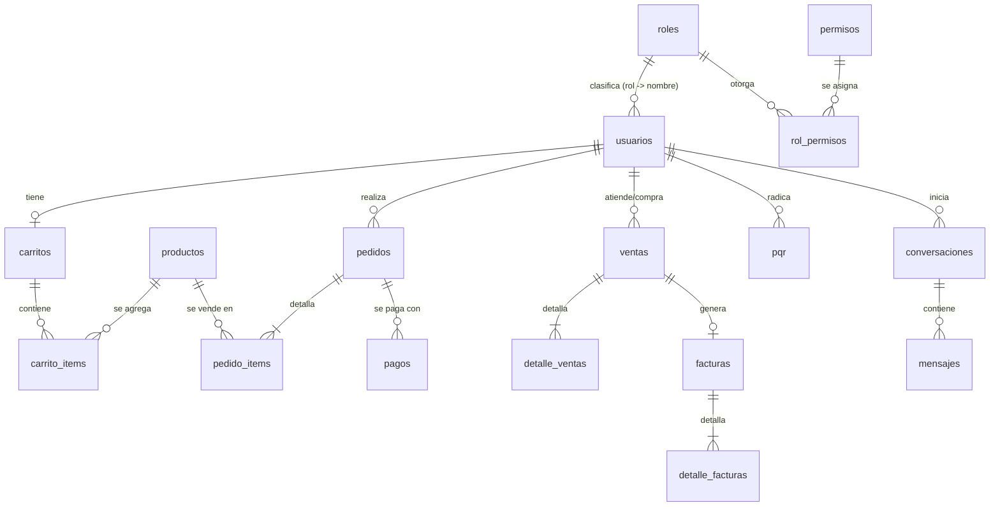

# Base de datos — Normalización

Fuente: `backend/database/schema_fastapi.sql` (MySQL/MariaDB) y `backend/app/models/`.
Este análisis explica **qué formas normales cumple el diseño, dónde hay desnormalización intencional y dónde hay deuda técnica**.

## 1. Repaso rápido

| Forma normal | Regla | Pregunta de control |
|---|---|---|
| **1FN** | Valores atómicos, sin grupos repetidos, hay clave primaria | ¿Cada celda guarda un solo dato? |
| **2FN** | 1FN + ningún atributo depende de *parte* de una clave compuesta | ¿Todo depende de *toda* la clave? |
| **3FN** | 2FN + ningún atributo depende de otro atributo no clave (dependencia transitiva) | ¿Todo depende *solo* de la clave? |

## 2. Modelo (resumen)

`pedidos.cupon_codigo` guarda el código del cupón como texto, **sin llave foránea** (ver tabla de 3FN). Las relaciones N:M se resuelven con tablas intermedias (`carrito_items`, `pedido_items`, `detalle_ventas`, `rol_permisos`), no con listas dentro de una columna.

## 3. Evaluación por forma normal

### 1FN — ✅ se cumple
- Todas las tablas tienen clave primaria (`id`).
- No hay columnas tipo lista ("producto1, producto2"): los ítems van en tablas hijas.
- Excepción menor: `pagos.respuesta_cruda` y `payload_webhook` son JSON. Son **bitácora de auditoría opaca** del proveedor (Wompi); la aplicación no consulta dentro de ellos, así que no viola el espíritu de la 1FN.

### 2FN — ✅ se cumple
- Las tablas de detalle usan clave subrogada (`id`) y guardan datos que dependen de la fila completa (cantidad, precio del ítem).
- En `rol_permisos` la clave es compuesta (rol, permiso) y no hay atributos adicionales: nada depende de una parte de la clave.

### 3FN — ✅ se cumple, con desnormalizaciones deliberadas y documentadas

| Caso | ¿Viola 3FN? | Justificación / decisión |
|---|---|---|
| `pedido_items.titulo` y `precio_unitario` (copia del producto) | Sí, **intencional** | *Snapshot histórico*: si mañana el producto cambia de precio o nombre, el pedido antiguo debe seguir mostrando lo que se compró. Es un requisito de negocio/contable, no un descuido. Igual en `detalle_ventas` y `detalle_facturas`. |
| `pedidos.total` (= subtotal − descuento) y `subtotal` de los ítems | Sí, **atributo derivado** | Se guarda para consultas y facturación rápidas y para congelar el valor cobrado. La coherencia la garantiza el servidor al crear el pedido (recalcula desde la BD, nunca confía en el navegador) y el pago se valida contra `pedidos.total`. |
| `pedidos.cupon_codigo` (texto, no FK) | Sí, **intencional** | El cupón puede editarse/eliminarse; el pedido conserva el código que se usó. |
| `pagos.correo_cliente`, `nombre_cliente` | Sí, **intencional** | Quien paga puede diferir de los datos actuales del usuario; se guarda lo enviado al proveedor. |
| `productos.familia` (ENUM) | No (dominio cerrado) | Un ENUM es aceptable para un catálogo fijo de 6 familias. Si el negocio las quisiera editar, pasaría a tabla `familias`. |
| `usuarios.direccion` (una sola cadena) | Discutible (1FN estricta) | Dirección como texto libre; se separaría en calle/ciudad/departamento solo si hiciera falta filtrar por ciudad. |

Los dos puntos de deuda técnica que tenía esta sección ya se corrigieron (normalización de esta versión):

| Caso (antes) | Corrección aplicada |
|---|---|
| `usuarios.rol` era un `ENUM('cliente','empleado','admin')` que describía el mismo dominio que la tabla `roles`, sin llave foránea entre ambos. | `usuarios.rol` pasó a `VARCHAR(20)` con `CONSTRAINT fk_usuarios_rol FOREIGN KEY (rol) REFERENCES roles(nombre) ON UPDATE CASCADE ON DELETE RESTRICT`. `roles.nombre` (ya `UNIQUE`) es ahora la única fuente de verdad del dominio: MySQL rechaza cualquier `usuarios.rol` que no exista en `roles`, y ya no se puede borrar un rol que todavía tenga usuarios. En el ORM (`app/models/usuario.py`), `RolUsuario` se conserva solo como el enum que valida los 3 valores permitidos en los esquemas Pydantic de entrada/salida. |
| `facturas.cliente_id` duplicaba, vía dependencia transitiva (`factura → venta → cliente`), un dato que ya vive en `ventas.cliente_id`. | Se eliminó la columna `facturas.cliente_id` (y su FK) de la tabla. En el ORM (`app/models/factura.py`) se reemplazó por un `association_proxy("venta", "cliente_id")`: `factura.cliente_id` se sigue leyendo igual en Python, y `Factura.cliente_id == valor` se sigue pudiendo filtrar en consultas — pero sin guardar el dato dos veces. |

## 4. Integridad, no solo formas normales

- Llaves foráneas con `ON DELETE` según el caso: `carrito_items` y `pedido_items` en `CASCADE`; `pagos.pedido_id` en `SET NULL` (el registro de pago se conserva); `ventas.cliente_id` sin cascada, para no perder historial contable; `usuarios.rol → roles.nombre` en `RESTRICT` (no se puede borrar un rol en uso), con `ON UPDATE CASCADE`.
- `UNIQUE`: `usuarios.correo`, `(tipo_documento, numero_documento)`, `productos.sku`, `pagos.referencia`, `facturas.numero`, `facturas.venta_id`, `ventas.pedido_id` y las llaves de idempotencia de pedidos y pagos (evitan duplicados por doble clic).
- `CHECK` (`precio >= 0`, `stock >= 0`, vigencia de cupones coherente) y estados como ENUM (`pendiente → pagado → enviado → entregado`).
- Índices en columnas de búsqueda y de llaves foráneas.

## 5. Conclusión para la sustentación

> El diseño está en **3FN**, salvo desnormalizaciones deliberadas de tipo *snapshot* (precio/título al momento de la
> compra, totales congelados) que existen por requisitos de historial contable y están documentadas caso por caso
> arriba. Los dos puntos de deuda técnica que tenía el diseño anterior (`usuarios.rol` sin FK a `roles` y
> `facturas.cliente_id` redundante) ya se corrigieron con llave foránea y `association_proxy` respectivamente.

**Preguntas típicas:** ¿por qué guardar el precio en `pedido_items` si ya está en `productos`? (historial: el precio cambia).
¿Qué es una dependencia transitiva? (A→B y B→C, entonces A→C pasando por un atributo no clave). ¿Cuándo conviene desnormalizar? (cuando el dato es histórico o hay un costo de lectura que lo justifica, y se documenta).
